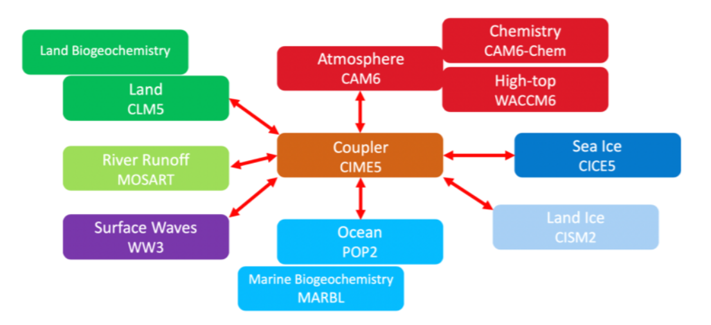

# Abstract      

Community Earth System Model (CESM; Gent et al., 2011; Lindsay et al., 2014) of the University Corporation for Atmospheric Research (UCAR) and National Center for Atmospheric Research (NCAR), Boulder, USA is a fully-coupled, community, global climate model that provides state-of-the-art computer simulations of the Earth's past, present, and future climate. 
NorESM (Norwegian Earth System Model) builds on the CESM but with specific additions including: 
 Chemistry-aerosol-cloud module of the atmosphere component developed by MET and UiO. 
 An ocean component that originates from the Miami Isopycnic Coordinate Ocean Model (MICOM) but extensively modified at NERSC and UNI. 
 Hamburg Model of Ocean Carbon Cycle adopted for use with an isopycnic ocean model by UiB and UNI. 
 New options for computing turbulent atmosphere-ocean fluxes and maintaining atmospheric energy and momentum consistency implemented by UNI.                                                                                         
# Application overview                                                                                         
CESM/NorESM is composed of separate models simultaneously simulating the Earth’s atmosphere, ocean, land, river run-off, land-ice, and sea-ice, plus one central coupler/moderator component. CESM/NorESM allows researchers to conduct fundamental research into the Earth’s past, present, and future climate states.

CESM can be run on a number of different hardware platforms, and has a relatively flexible design with respect to processor layout of components. However, it has not been built for running within containers.

The following are the external system and software requirements for installing and running CESM2.

- UNIX style operating system such as CNL, AIX or Linux
- python >= 2.7
- perl 5 and perl(XML::LibXML)
- subversion client (version 1.8 or greater but less than v1.11) for downloading CAM, POP, and WW3
- git client (1.8 or greater)
- Fortran compiler with support for Fortran 2003
- C compiler
- MPI
- NetCDF 4.3 or newer (C and Fortran)
- pnetcdf 1.7.0 is required and 1.8.1 is optional but recommended
- LAPACK and BLAS (we use mkl when using Intel compilers)
- CMake 2.8.6 or newer

Parallel-netCDF (pnetcdf) version 1.7.0 or later should be used with CESM. It is a library that is file-format compatible with netCDF, and provides higher performance by using MPI-IO. Pnetcdf is enabled by setting the $PNETCDF_PATH Makefile variable in the Macros.make file.

