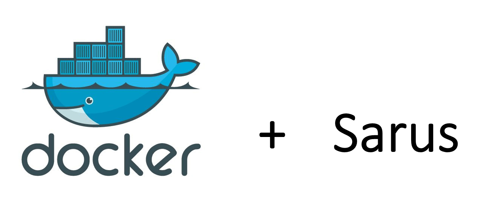
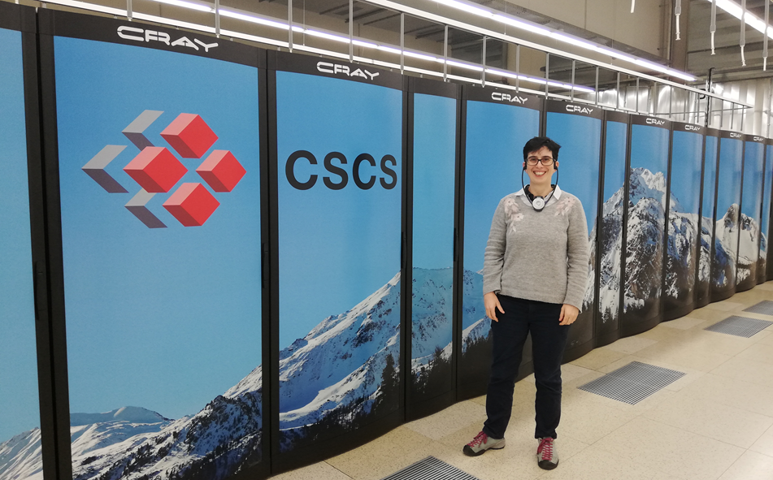

# ESiWACE2 Container Hackathon for Modellers

**Dec. 3 - Dec 5 2019 in Lugano, Switzerland**.

See [ESiWACE2 Container Hackathon for Modellers](https://github.com/eth-cscs/ContainerHackathon).

Atmosphere and ocean models are characterised by complex dependencies, external configurations, and performance requirements.
The objective to containerise such software stacks helps to provide a consistent environment to ensure security, portability and performance.
Since the container is built only once, but then can be deployed on multiple platforms, productivity is increased.
ETH Zurich provides subsequent Docker/Shifter support for the teams to complete the containerisation of their models.

Head over to the [Wiki](https://github.com/eth-cscs/ContainerHackathon/wiki) for further details.

## Aim of the hackathon
To create containerised versions of Earth system models (e.g. COSMO, ICON, Nemo, OpenIFS, EC-Earth) using a Docker-compatible technologies and to identify representative test cases.
In order to help evaluating performance when containers are used and which adaptations are necessary, the ported Earth system models from the hackathon is going to be deployed on CSCS supercomputer (Piz Daint) using an HPC-oriented container runtime.
The Docker-compatible format of runtime will ease container portability across different systems and help collecting the performance figures from the representative test case.

## Github repository

The material for the hackathon is available at [ContainerHackathon](https://github.com/eth-cscs/ContainerHackathon/blob/master/README.md).

This area is meant for learning materials, examples, and sharing ideas about containerization of high-performance weather-simulation codes during the first Container Hackathon for Modellers between Dec. 3 - Dec 5 2019 in Lugano, Switzerland.


# NorESM/CESM

### CSCS mentor: [Kean Mariotti](https://github.com/rukkal)

## Preparatory work

To maximize our participation to the [ESiWACE2 Container Hackathon for Modellers](https://github.com/eth-cscs/ContainerHackathon) organized at [CSCS Lugano](https://www.cscs.ch/), we did quite some work before the hackathon. 

At the beginning of the hackathon we already had containers with five small models. This is a list of the models (from smallest to largest):
- [FKESSLER](https://github.com/NordicESMhub/fkessler_docker) - Moist baroclinic wave with Kessler microphysics.	 
- [F1850](https://github.com/NordicESMhub/F1850_docker) - Pre-industrial cam/clm with prescribed ice/ocn.                      
- [CESM historic with CAM6 and CLM5](https://github.com/NordicESMhub/hc6l5_docker) (no ocean)
- [VR-CESM historic with CAM6 and CLM5 (no ocean) and variable resolution](https://github.com/NordicESMhub/VR-CESM_docker) with spectral element core.
- [NorESM-CAM](https://github.com/NorESMhub/NorESMCAM_docker): NorESM configuration with CAM-Oslo and CLM.     	 

We have also been working on two more containers with bigger configurations (fully coupled configurations), but in this case there were still build-time issues to solve:

- [B1850](https://github.com/NordicESMhub/B1850_docker) - a fully coupled configuration (1 degree resolution and pre-industrial).                        	 
- [NorESM fully coupled](https://github.com/NorESMhub/i16N1850_docker) N1850 compset and f19_tn14 resolution.

The last configuration (NorESM fully coupled) was set as our ultimate goal for the hackathon.                         	 

## Approach

We decided to go through the models from smallest to largest and make sure that they can all run on Piz Daint.

We will reuse as much as possible what has been done during the preparatory work. On Piz Daint, we will be use [Sarus](https://sarus.readthedocs.io/en/latest/).



### What is Sarus?

[Sarus](https://sarus.readthedocs.io/en/latest/) is an OCI-compatible container engine for HPC developed and maintained by [CSCS](https://www.cscs.ch/).

Sarus is freely available and distributed under Copyright (c) 2018-2019 ETH Zurich. All rights reserved. See [Sarus License](https://github.com/eth-cscs/sarus/blob/master/LICENSE) for more information.

### Sarus on Piz Daint

We use the current available version on Piz Daint (1.0.1). 

```
module load sarus
```

### Advantage of Sarus (user point of view)

The main advantages are:

- re-use docker containers we built on laptop or small virtual machines.
- very user friendly (most commands are similar to what we know from docker).
- safe for HPC
- support OCI hooks so we can use "native" MPI libraries on HPC for improved performance.
- expertise available at CSCS (main developer)

# Day-1

While we had prepared several docker images prior to the hackathon, none could be used out-of-the-box on [Piz Daint](https://www.cscs.ch/computers/piz-daint/).

> ## Why our docker containers were not compatible?
>
> 1. Support for OCI hooks for MPI libraries requires the usage of MPI libraries that are compatible with those installed on Piz Daint. 
> The current MPI libraries provided by CRAY do not support recent versions of MPICH.
> We needed to recompile CESM/NorESM with MPICH 3.1.4.
> 2. Support for OCI hooks is based on `ldconfig`: our docker containers were built from `busybox` using `conda` for installing cesm. The [CESM base image](https://bioconda.github.io/recipes/cesm/README.html) did not come with `ldconfig`.
> 3. Several of our docker images were pushed to [quay.io nordicesmhub repository](https://quay.io/organization/nordicesmhub) while Sarus can only pull images from [docker hub](https://hub.docker.com/).
>
>
{: .callout}

### Create Piz-daint compatible docker images

We decided to recompile and generate new docker containers for all our cases:
- Start from `debian:buster` as a base image.
- Skip `conda` and install manually mpich, hdf5, netcdf (C and Fortran) 
- Create a base image [CESM GNU libraries](https://github.com/NordicESMhub/cesm_docker_libs) that we will reuse for all our configurations.
- Create docker containers for all our initially chosen configuration.
- Test as much CESM/NorESM configurations as possible on Piz-Daint.

The base image for NorESM/CESM (GNU compilers) is available on quay.io:

```
docker pull quay.io/nordicesmhub/cesm_libs
```

Source code is on github in [cesm_docker_libs repository](https://github.com/NordicESMhub/cesm_docker_libs).

### Run a simple case: FKESSLER

A new docker container for FKESSLER was generated and we saved the docker container image in docker hub:

```
docker pull nordicesmhub/fkessler:1.0
```

> ## Slurm, sarus and CESM/NorESM submit
>
> When running on HPC, we configure the batch systems for running NorESM/CESM in 
> an xml file called `config_batch.xml`. This file is part of [Common Infrastructure for Modeling the Earth (cime)](http://esmci.github.io/cime/) and already support [slurm](https://slurm.schedmd.com/). However, it assumes NorESM/CESM executable is run directly and not using sarus.
> Then for running NorESM/CESM, we use `case.submit` a python script that generates a batch script and submit it to the batch system.
> The current `config_batch.xml` for slurm on [Fram](https://www.sigma2.no/Fram) (Norwegian HPC):
>
> ```
>   <batch_system MACH="fram" type="slurm">
>    <batch_submit>sbatch</batch_submit>
>      <directives>
>        <directive> --switches=1</directive>
>	 <directive> --ntasks={{ total_tasks }}</directive>
>        <directive> --export=ALL</directive>
>      </directives>
>     <queues>
>       <queue walltimemax="00:59:00" nodemin="1" nodemax="288" default="true">normal</queue>
>     </queues>
>   </batch_system>
> ```
>
> Rather than spending time on creating a new configuration file for Piz Daint, we decided to "hack" and bypass `case.submit` so we can test as many configurations as possible.
> To do so, we first use `case.submit` without running the case (just to prepare and copy namelists and other configuration files) and then run our case directly by calling `cesm.exe`.
{: .callout}

At the end of **day-1**, Kean made a first run on dom:

- Step-1: pull image locally

```
sarus pull nordicesmhub/fkessler:1.0
```

- Step-2: Prepare and copy namelists and FKESSLER configuration files:

     - Create a shared run folder (accessible by all processors)
```
mkdir -p /scratch/snx3000/hck07/container-hackaton-for-modelers/run/fkessler
```
     - Use case.submit to prepare FKESSLER case in the run folder
```
sarus run -t --mount=src=/scratch/snx3000/hck07/container-hackaton-for-modelers/run/fkessler,dst=/run,type=bind --mount=src=/project/csstaff/mkean/container-hackaton-for-modelers/data/inputdata_vr,dst=/root/inputdata,type=bind nordicesmhub/fkessler:1.0 bash -c ‘rm $(which mpiexec); cd /root/cases/fkessler; ./case.submit; cp -r /root/work/fkessler/run/* /run/’
```


The command `rm $(which mpiexec);` is used as a trick to prevent our case to start running (because we configured it to use mpiexec).


- Step-3: run FKESSLER

```
srun -C gpu --reservation=esiwace_1  --pty -n 4 -N 1 sarus run -t --mpi --mount=src=/project/csstaff/mkean/container-hackaton-for-modelers/data/inputdata,dst=/root/inputdata,type=bind nordicesmhub/fkessler:1.0 bash -c "cd /root/work/fkessler/run && /root/work/fkessler/bld/cesm.exe"
```

This very simplified case was able to successfully run on CSCS HPC.

It took 118s (wall clock time) on 4 processors. This is very similar to what we usually get on our Virtual Machine on the same number of processors.

> ## Summary day-1
>
> - Created a [new base image](https://github.com/NordicESMhub/cesm_docker_libs) with all the necessary libraries (MPICH, hdf5, netCDF C and Fortran). This docker container is available on [quay.io nordicesmhub cesm_libs](https://quay.io/repository/nordicesmhub/cesm_libs).
> - Re-created docker images that are compatible with Piz-Daint for our configurations.
> - Trick NorESM/CESM `case.submit` to be able to run NorESM/CESM in a container with a batch system (slurm).
> - Successfully ran [FKESSLER](https://hub.docker.com/repository/docker/nordicesmhub/fkessler) case on CSCS HPC
{: .challenge}

# Day-2

### Run all prepared configuration on Piz-Daint

Following the same procedures, we ran all our cases on Piz Daint with a minimal number of processors to make sure our approach was correct.

#### F1850

This is still a simple configuration with pre-industrial (1850) atmosphere and land components and prescribed ice and ocean. See https://github.com/NordicESMhub/F1850_docker for dockerfile and associated scripts. The docker image is saved in quay https://quay.io/repository/nordicesmhub/cesm_f1850

```
mkdir -p /scratch/snx3000tds/mkean/container-hackaton-for-modelers/run/F1850

sarus run -t --mount=src=/scratch/snx3000tds/mkean/container-hackaton-for-modelers/run/F1850,dst=/run,type=bind --mount=src=/project/csstaff/mkean/container-hackaton-for-modelers/data/inputdata,dst=/root/inputdata,type=bind nordicesmhub/cesm_f1850:1.0 bash -c ‘rm $(which mpiexec); cd /root/cases/F1850; ./case.submit; cp -r /root/work/F1850/run /run/’

srun -C mc -n 8 -N 1 sarus run --mpi --mount=src=/scratch/snx3000tds/mkean/container-hackaton-for-modelers/run/F1850,dst=/root/work/F1850/run,type=bind --mount=src=/project/csstaff/mkean/container-hackaton-for-modelers/data/inputdata,dst=/root/inputdata,type=bind nordicesmhub/cesm_f1850:1.0 bash -c 'cd /root/work/F1850/run && /root/work/F1850/bld/cesm.exe'
```

The run was successful so we decided to move to two more complex cases:

- [VR-CESM](https://github.com/NordicESMhub/VR-CESM_docker) (variable resolution CAM CLM). Even though this case uses similar components than F1850, it is more complex (high resolution) and uses spectral core. This configuration is important for us because it improves the reliability of our climate simulations and projections, particularly in the regions with complex terrains (that are generally greatly limited by the model resolution). 
In our configuration, we have a 1 degree resolution (lowest resolution) to about 12.5 km (high resolution). 
- B1850/N1850: fully coupled configuration with all the components we use for running [CMIP6](https://www.wcrp-climate.org/wgcm-cmip/wgcm-cmip6).

For these two cases, our goal was to run with different number of nodes.

### Run VR-CESM on different nodes

#### Setup and docker container for VR-CESM

See [VR-CESM docker files](https://github.com/NordicESMhub/VR-CESM_docker).

NorESM/CESM is not a very flexible model and one needs to recompile it every time the
number of nodes or tasks per node are changed. While we initially created docker for running one configuration only, we found out that it would be faster to generate as many configurations as we wish to test in one single container. 

Our goal was to test several processor layouts so we generated 5 cases:

- VR-CESM on 1 node (12 processors)
- VR-CESM on 4 nodes (48 processors)
- VR-CESM on 8 nodes (96 processors)
- VR-CESM on 16 nodes (192 processors)
- VR CESM on 42 nodes (504 processors)

The dockerfile and configuration for generating this docker container is in `piz-daint` branch on [VR-CESM github repository](https://github.com/NordicESMhub/VR-CESM_docker/tree/piz-daint).

### Run VR-CESM on Piz-Daint

We used the same approach:

1. Create a container with all the cases on a Virtual Machine with docker. 

   ```
   git clone -b piz-daint https://github.com/NordicESMhub/VR-CESM_docker

   cd VR-CESM_docker

   docker build -t nordicesmhub/vr-cesm:2.0 .
   ```

2. Save docker container in a tarball 

   ```
   docker save nordicesmhub/vr-cesm:2.0 -o vr-cesm_2.0.tar
   ```
3. Copy tarball on `ela.cscs.ch`:

   ```
   scp vr-cesm_2.0.tar hck07@ela.cscs.ch:.
   ```
4. Login on Diz-Paint and load image from tarball

   ```
   sarus load vr-cesm_2.0.tar nordicesmhub/vr_cesm:2.0
   ```
5. Create a shared `run` folder

   ```
   mkdir -p /scratch/snx3000/$USER/container-hackaton-for-modelers/run/vr_cesmcase1
   mkdir -p /scratch/snx3000/$USER/container-hackaton-for-modelers/run/vr_cesmcase2
   mkdir -p /scratch/snx3000/$USER/container-hackaton-for-modelers/run/vr_cesmcase3
   mkdir -p /scratch/snx3000/$USER/container-hackaton-for-modelers/run/vr_cesmcase4
   mkdir -p /scratch/snx3000/$USER/container-hackaton-for-modelers/run/vr_cesmcase5
   ```
6. Prepare run with `case.submit` CESM/NorESM script but prevent it to run (remove `mpiexec`)
    - Case-1:

      ```
      sarus run -t --mount=src=/scratch/snx3000/$USER/container-hackaton-for-modelers/run/vr_cesmcase1,dst=/run,type=bind \
 --mount=src=/project/csstaff/mkean/container-hackaton-for-modelers/data/inputdata_vr,dst=/root/inputdata,type=bind load/nordicesmhub/vr_cesm:2.0 bash \
  -c 'rm $(which mpiexec); cd /root/cases/vr-cesmcase1; ./preview_run; ./case.submit; cp -r /root/work/vr-cesmcase1/run/* /run/' 
      ``` 
    - Case-2:

      ```
 sarus run -t --mount=src=/scratch/snx3000/$USER/container-hackaton-for-modelers/run/vr_cesmcase2,dst=/run,type=bind \
 --mount=src=/project/csstaff/mkean/container-hackaton-for-modelers/data/inputdata_vr,dst=/root/inputdata,type=bind load/nordicesmhub/vr_cesm:2.0 bash \
  -c 'rm $(which mpiexec); cd /root/cases/vr-cesmcase2; ./preview_run; ./case.submit; cp -r /root/work/vr-cesmcase2/run/* /run/' 
      ``` 
    - Case-3:

      ```
 sarus run -t --mount=src=/scratch/snx3000/$USER/container-hackaton-for-modelers/run/vr_cesmcase3,dst=/run,type=bind \
 --mount=src=/project/csstaff/mkean/container-hackaton-for-modelers/data/inputdata_vr,dst=/root/inputdata,type=bind load/nordicesmhub/vr_cesm:2.0 bash \
  -c 'rm $(which mpiexec); cd /root/cases/vr-cesmcase3; ./preview_run; ./case.submit; cp -r /root/work/vr-cesmcase3/run/* /run/' 
      ``` 
    - Case-4:

      ```
 sarus run -t --mount=src=/scratch/snx3000/$USER/container-hackaton-for-modelers/run/vr_cesmcase4,dst=/run,type=bind \
 --mount=src=/project/csstaff/mkean/container-hackaton-for-modelers/data/inputdata_vr,dst=/root/inputdata,type=bind load/nordicesmhub/vr_cesm:2.0 bash \
  -c 'rm $(which mpiexec); cd /root/cases/vr-cesmcase4; ./preview_run; ./case.submit; cp -r /root/work/vr-cesmcase4/run/* /run/' 
      ``` 
    - Case-5:

      ```
 sarus run -t --mount=src=/scratch/snx3000/$USER/container-hackaton-for-modelers/run/vr_cesmcase5,dst=/run,type=bind \
 --mount=src=/project/csstaff/mkean/container-hackaton-for-modelers/data/inputdata_vr,dst=/root/inputdata,type=bind load/nordicesmhub/vr_cesm:2.0 bash \
  -c 'rm $(which mpiexec); cd /root/cases/vr-cesmcase5; ./preview_run; ./case.submit; cp -r /root/work/vr-cesmcase5/run/* /run/' 
      ``` 
7. Run `cesm.exe`
     - Case-1:

      ```
srun -C gpu --reservation=esiwace_1 -N 1 -n 12 sarus run --mpi --mount=src=/scratch/snx3000/mkean/container-hackaton-for-modelers/run/vr_cesmcase1,dst=/root/work/vr-cesm/run,type=bind --mount=src=/project/csstaff/mkean/container-hackaton-for-modelers/data/inputdata_vr,dst=/root/inputdata,type=bind load/nordicesmhub/vr_cesm:2.0 bash -c 'cd /root/work/vr-cesmcase1/run && /root/work/vr-cesm/bld/cesm.exe'
      ```
     - Case-2:

      ```
srun -C gpu --reservation=esiwace_1 -N 4 -n 48 -t 360 sarus run --mpi \
 --mount=src=/scratch/snx3000/$USER/container-hackaton-for-modelers/run/vr_cesmcase2,dst=/root/work/vr-cesmcase2/run,type=bind \
 --mount=src=/project/csstaff/mkean/container-hackaton-for-modelers/data/inputdata_vr,dst=/root/inputdata,type=bind load/nordicesmhub/vr_cesm:2.0 bash \
  -c 'cd /root/work/vr-cesmcase2/run && /root/work/vr-cesmcase2/bld/cesm.exe'
      ```
     - Case-3:

      ```
 srun -C gpu --reservation=esiwace_1 -N 8 -n 96 -t 360 sarus run --mpi \
 --mount=src=/scratch/snx3000/$USER/container-hackaton-for-modelers/run/vr_cesmcase3,dst=/root/work/vr-cesmcase3/run,type=bind \
 --mount=src=/project/csstaff/mkean/container-hackaton-for-modelers/data/inputdata_vr,dst=/root/inputdata,type=bind load/nordicesmhub/vr_cesm:2.0 bash \
  -c 'cd /root/work/vr-cesmcase3/run && /root/work/vr-cesmcase3/bld/cesm.exe'
      ```
     - Case-4:

      ```
srun -C gpu --reservation=esiwace_1 -N 16 -n 192 -t 360 sarus run --mpi \
--mount=src=/scratch/snx3000/$USER/container-hackaton-for-modelers/run/vr_cesmcase4,dst=/root/work/vr-cesmcase4/run,type=bind \
--mount=src=/project/csstaff/mkean/container-hackaton-for-modelers/data/inputdata_vr,dst=/root/inputdata,type=bind load/nordicesmhub/vr_cesm:2.0 bash \
 -c 'cd /root/work/vr-cesmcase4/run && /root/work/vr-cesmcase4/bld/cesm.exe'
      ```
     - Case-5:

      ```
srun -C gpu --reservation=esiwace_2 -N 42 -n 504 -t 360 sarus run --mpi \
     --mount=src=/scratch/snx3000/$USER/container-hackaton-for-modelers/run/vr_cesmcase5,dst=/root/work/vr-cesmcase5/run,type=bind \
     --mount=src=/project/csstaff/mkean/container-hackaton-for-modelers/data/inputdata_vr,dst=/root/inputdata,type=bind load/nordicesmhub/vr_cesm:2.0 bash \
      -c 'cd /root/work/vr-cesmcase5/run && /root/work/vr-cesmcase5/bld/cesm.exe; if [ ${SLURM_PROCID} = 0 ]; then cp -R /root/cases/vr-cesmcase5 /root/work/vr-cesmcase5/run/.; fi'
      ```

### Results

All cases were setup to run one day (while normally we run climate models over decades or at least 20-30 years). However, the main goal here was to be able to run different layout and get some inputs about the behavior of VR-CESM when run in a docker container.

- Case-1: Did not record time. (12 processors)
- Case-2: 6598 s (48 processors)
- Case-3: 3325 s (96 processors)
- Case-4: 1701 s (192 processors)
- Case-5: 1681 s (504 processors)

> ## CESM/NorESM timings
> We used what is provided by CESM/NorESM and saved in the timing folder (run directory).
> We took "CPL:RUN_LOOP" e.g. the wall clock time without the model initialization ("CPL:INIT"). The model initialization is usually constant (or vary little) and depends very little on the number of processors used.
>
{: .callout}

Results are very similar to what we get on our HPC. Timing obtained for Case-5 is a bit surprising to us. We did not expect it to exhibit so poor scaling with 504 processors. However, we realized afterwards that in these cases, we setup the model to save daily outputs so the runs most likely spent most of the time writing model outputs.

### Generate fully coupled NorESM/CESM docker (GNU-compiler)

Initially we couldn’t build the code because of linker errors such as:

```
/usr/bin/ld: cime_comp_mod.o: in function `__cime_comp_mod_MOD_cime_final': 
109 cime_comp_mod.F90:(.text+0x8bd): relocation truncated to fit: R_X86_64_PC32 against symbol `__seq_comm_mct_MOD_cpl_inst_tag' defined in .bss section in ../../gnu/mpich/nodebug/nothreads/mct/noesmf/c1a1l1i1o1r1g1w1e1/lib/libcsm_share.a(seq_comm_mct.o)
```

The linker error was due to the fact that the `.bss` section of the program (static variables) is very big (over 7 GB) and the machine instructions generated with the default code model are not able to reference symbols with an offset greater than 32 bits. To solve the issue we recompiled the application with the “medium” memory model. To do so we modified ~/.cime/config_compilers.xml in the container: 

```
# cat ~/.cime/config_compilers.xml
<?xml version="1.0"?>

<config_compilers version="2.0">
  <compiler COMPILER="gnu" MACH="espresso">
  <LD>mpifort</LD>
  <AR>ar</AR>
  <SFC>gfortran</SFC>
  <SCC>cc</SCC>
  <SCXX>c++</SCXX>
  <MPIFC>mpifort</MPIFC>
  <MPICC>mpicc</MPICC>
  <MPICXX>mpicxx</MPICXX>
  <NETCDF_PATH>/usr</NETCDF_PATH>
  <CFLAGS>
    <append DEBUG="FALSE"> -mcmodel=medium -O2</append>
  </CFLAGS>
  <FFLAGS>
    <append DEBUG="FALSE"> -mcmodel=medium -O2</append>
    <append MODEL="micom"> -fdefault-real-8 </append>
    <append MODEL="cam"> -finit-local-zero </append>
  </FFLAGS>
  <SLIBS>
    <append> -L$(NETCDF_PATH)/lib -lnetcdff -lnetcdf -ldl -mcmodel=large </append>
    <append> -lblas -llapack -lgomp -lpthread -lm -fopenmp </append>
    <append> -Wl,--verbose -Wl,-Map=/root/inputdata/output.map_test_mdmodel  </append>
  </SLIBS>
  </compiler>
</config_compilers>
```
### Test

We ran a first test with B1850 on day-2 following the same approach as before:

- We generate the docker image on our Virtual machine, build it and save it as a tarball. Once transfered on Piz-Daint, we load it with sarus and run it:

```
sarus load b1850_gnu_108.tar nordicesmhub_b1850:1.0

mkdir -p /scratch/snx3000/$USER/container-hackaton-for-modelers/run/B1850

sarus run -t --mount=src=/scratch/snx3000/$USER/container-hackaton-for-modelers/run/B1850,dst=/run,type=bind \
 --mount=src=/project/csstaff/mkean/container-hackaton-for-modelers/data/inputdata_B1850,dst=/root/inputdata,type=bind load/library/nordicesmhub_b1850:1.0 bash \
  -c 'rm $(which mpiexec); cd /root/cases/B1850; ./preview_run; ./case.submit; cp -r /root/work/B1850/run/* /run/' 
   
srun -C gpu --reservation=esiwace_2 -N 9 -n 108 -t 360 sarus run --mpi \
    --mount=src=/scratch/snx3000/$USER/container-hackaton-for-modelers/run/B1850,dst=/root/work/B1850/run,type=bind \
    --mount=src=/project/csstaff/mkean/container-hackaton-for-modelers/data/inputdata_B1850,dst=/root/inputdata,type=bind     load/library/nordicesmhub_b1850:1.0    bash \
     -c 'cd /root/work/B1850/run && /root/work/B1850/bld/cesm.exe; if [ ${SLURM_PROCID} = 0 ]; then cp -R /root/cases/B1850 /root/work/B1850/run/.; fi'
```

> ## Summary day-2
> - Successfully ran [F1850](https://github.com/NordicESMhub/F1850_docker) configuration on Piz Daint (8 processors).
> - Prepare a docker container on our Virtual Machine for [VR-CESM](https://github.com/NordicESMhub/VR-CESM_docker/tree/piz-daint) for 5 different processor layouts.
> - Ran VR-CESM for 5 different processor layouts (12, 48, 96, 192 and 504 processors) and got expected performance except for the last case (504 processors) for which performance were bad on Piz-Daint. 
> - Fix link problem with B1850 (this problem only appeared with GNU compilers inside the docker) and created a B1850 docker container.
> - Successfully ran [B1850](https://github.com/NordicESMhub/B1850_docker) case on CSCS HPC Piz Daint using 9 nodes (108 processors).
{: .challenge}

# Day-3

### Create fully coupled NorESM/CESM containers

We created two docker containers for both [B1850 GNU](https://github.com/NordicESMhub/B1850_docker/tree/piz-daint) and [B1850 intel compilers](https://github.com/NordicESMhub/B1850_docker_intel/) for six different processor layouts:

- Case-1: 4 nodes, 48 processors
- Case-2: 8 nodes, 96 processors
- Case-3: 16 nodes, 192 processors
- Case-4: 42 nodes, 504 processors
- Case-5: 84 nodes, 1008 processors
- Case-6: 168 nodes, 2016 processors

However, we only tested case-1 (48 processors) to case-4 (504 processors) on Piz Daint.

All cases were configured to run 5 days and we kept monthly outputs so we don't write final model outputs at the end of each simulation (so we get some information about scaling and not I/Os).

We save the generated docker containers as tarball and transfered them on Piz-Daint:

```
docker save nordicesmhub_b1850_gnu:1.0 -o nordicesmhub_b1850_gnu.tar
docker save nordicesmhub_b1850_intel:1.0 -o nordicesmhub_b1850_intel.tar
```

Then load on Piz Daint:

```
sarus load nordicesmhub_b1850_gnu.tar nordicesmhub_b1850:gnu
sarus load nordicesmhub_b1850_intel.tar nordicesmhub_b1850:intel
```

### Run fully coupled NorESM/CESM on different number of nodes

- Prepare run folders (one per case and per compiler):

```
for i in 1 2 3 4 5; do
   mkdir -p /scratch/snx3000/$USER/container-hackaton-for-modelers/run/intel/B1850case$i
   mkdir -p /scratch/snx3000/$USER/container-hackaton-for-modelers/run/gnu/B1850case$i
done
```

- Prepare gnu configuration file (case.submit without running case):

```
for i in 1 2 3 4 5; do
 sarus run -t --mount=src=/scratch/snx3000/$USER/container-hackaton-for-modelers/run/gnu/B1850case$i,dst=/run,type=bind \
 --mount=src=/project/csstaff/mkean/container-hackaton-for-modelers/data/inputdata_B1850,dst=/root/inputdata,type=bind load/library/nordicesmhub_b1850:gnu bash \
  -c “rm \$(which mpiexec); cd /root/cases/B1850case${i}; ./preview_run; ./case.submit; cp -r /root/work/B1850case${i}/run/* /run/”
  done 
```

-  Prepare intel

```
for i in 1 2 3 4 5; do
     sarus run -t --mount=src=/scratch/snx3000/$USER/container-hackaton-for-modelers/run/intel/B1850case$i,dst=/run,type=bind \
     --mount=src=/project/csstaff/mkean/container-hackaton-for-modelers/data/inputdata_B1850,dst=/root/inputdata,type=bind load/library/nordicesmhub_b1850:intel  bash \
      -c ". /opt/intel/parallel_studio_xe_2018.1.038/psxevars.sh; rm \$(which mpiexec); cd /root/cases/B1850case${i}; ./preview_run; ./case.submit; cp -r /root/work/B1850case${i}/run/* /run/"
done 
```

- Test case-1 with both GNU and intel compilers

     - Test config 1 with gnu compilers

       ```
 srun -C gpu --reservation=esiwace_2 -N 4 -n 48 -t 360 sarus run --mpi \
 --mount=src=/scratch/snx3000/$USER/container-hackaton-for-modelers/run/gnu/B1850case1,dst=/root/work/B1850case1/run,type=bind \
 --mount=src=/project/csstaff/mkean/container-hackaton-for-modelers/data/inputdata_B1850,dst=/root/inputdata,type=bind  load/library/nordicesmhub_b1850:gnu       bash \
  -c 'cd /root/work/B1850case1/run && /root/work/B1850case1/bld/cesm.exe; if [ ${SLURM_PROCID} = 0 ]; then cp -R /root/cases/B1850ase1 /root/work/B1850case1/run/.; fi'
       ```

       The test ran successfully.

     - Test config 1 with intel compilers

       ```
       srun -C gpu --reservation=esiwace_2 -N 4 -n 48 -t 360 sarus run --mpi \
       --mount=src=/scratch/snx3000/$USER/container-hackaton-for-modelers/run/intel/B1850case1,dst=/root/work/B1850case1/run,type=bind \
       --mount=src=/project/csstaff/mkean/container-hackaton-for-modelers/data/inputdata_B1850,dst=/root/inputdata,type=bind  load/library/nordicesmhub_b1850:intel       bash \
        -c 'cd /root/work/B1850case1/run && /root/work/B1850case1/bld/cesm.exe; if [ ${SLURM_PROCID} = 0 ]; then cp -R /root/cases/B1850case1 /root/work/B1850case1/run/.; fi'
       ```

       We encountered a number of problems:

        1. The test failed because intel compilers were not available. We found out that `/opt/intel` was "empty" in the docker container. So rather than creating a base image `cesm_docker_intel_libs` (and use the base image for generating NorESM/CESM docker image with intel compilers), we created a docker image containing everything.
	In addition, we exported the image from a running docker image rather than creating it with `docker save`:
	   ```
	   docker export 28c7d8c6ca16 -o nordicesmhub_b1850_intel_active.tar
	   ```
	   Or to reuse the docker container locally:
	   ```
	   docker export 28c7d8c6ca16 | docker import - nordicesmhub/b1850:intel
	   ```
	   Once transfered on Piz Daint, we load it as before (sarus load) but it failed (we got a strange error) so we had to load it "manually":
	   ```
	    tar -xf nordicesmhub_b1850_intel_active.tar  | mksquashfs intel.squashfs 
	   ```
	   Then we replaced the existing loaded (but wrong) intel image:
	   ```
	   mv intel.squashfs $SCRATCH/.sarus/images/load/library/nordicesmhub/b1850/.
	   ```
        2. However, it was still failing because, sarus could not "remap" the mpi intel libraries to the CRAY native MPI libraries. We realized that ldconfig (in the docker container) did not show intel MPI libraries properly. 
	`ldconfig` was not correct so we had to manually create a new file `intel.mpi.conf` (in the container on our Virtual Machine) in `/etc/ld.so.conf.d` with:
           ```
	   /opt/intel/compilers_and_libraries_2018.1.163/linux/mpi/intel64/lib
           ```
           It indicates the path to the Intel MPI libraries because sarus needs to know where the MPI libraries are and it uses `ldconfig` to find out.
	   We exported again our docker image and load it on Piz Daint:
	   ```
	   docker export 28c7d8c6ca16 -o nordicesmhub_b1850_intel_active.tar
	   ```
	   And also loaded the intel image manually with `mksquashfs`.
           It seemed to work properly but we found out that NorESM/CESM was compiled in DEBUG mode while we specified the release MPI libraries in ldconfig (in our docker container). We tried to fix it:
	   ```
	   cat /etc/ld.so.conf.d/intel.mpi.conf 
	   /opt/intel/compilers_and_libraries_2018.1.163/linux/mpi/intel64/lib
	   /opt/intel/compilers_and_libraries_2018.1.163/linux/mpi/intel64/lib/debug_mt/
	   ```
	   We still got an error and ran out of time so we could not run B1850 with intel compilers. However, all the problems were helpful to understand sarus (and OCI hooks).

- Run gnu and intel cases as a batch script.

Kean prepared a [batch script](https://raw.githubusercontent.com/NordicESMhub/containers/master/run.sbatch) to be able to run all the cases (using the same allocation).

However, we realized the docker container prepared with intel compilers did not work properly so we only ran cases with GNU compilers.

### Results (GNU compilers)

We only managed to run the 4 cases once only.

- Case-1: 2434 s (4 nodes, 48 processors)
- Case-2: 1293 s (8 nodes, 96 processors)
- Case-3: 670 s (16 nodes, 192 processors)
- Case-4: 170 s (42 nodes, 504 processors)

> ## How do we measure time?
> In the results shown above, we removed the initialization time ("CPL:INIT") which is about 1250 s for B1850 case. It varies slightly and to be accurate we used timing as provided by CESM.
> All the timings are from `timing/model_timing_stats` (as given by CESM run in the run directory).
>
{: .callout}

Overall these results are very similar (or better) to what we usually get on our HPC ([fram](https://www.sigma2.no/Fram)). However, we never use the exact same number of processors because we have 32 processors per node on Fram.

Scaling is similar to what we get on our HPC and what is expected for a fully coupled climate model.

On our development machine (Virtual Machine, 16 processors, 128GB RAM), we get 15582 s on 16 processors (without docker).

### Installation of sarus on our local machine

We installed sarus on our development machine e.g. a Virtual Machine:
- 16 processors and 128GB memory. 
- Used for NorESM/CESM model development

This machine will be helpful for testing configurations with Intel compilers. We will also be able to compare performance on the same machine with and without sarus.

The next step will be to install sarus on the Norwegian national infrastructure (2 HPCs).
A formal request will be sent to [Sigma-2](https://www.sigma2.no/) (in charge of these HPCs).

### Visit of the CSCS Lugano HPC computer room



> ## Summary day-3
> - Create B1850 docker containers for several processor layouts and both for GNU and Intel compilers
> - Get a better understanding of sarus and how OCI hooks "work". 
> - Learn to generate `ldconfig` "manually" by creating a "mapping" file in a docker container.
> - Run B1850 with Intel Compilers for 4 different processor layout. Performance were good and similar to what we usually get with a B1850 case on our HPC.
> - Visit of the CSCS Computer room (it was fun!).
{: .challenge}

# Future work

1. Finalize docker container with intel compilers and test with sarus on our Virtual machine
2. Compare performance with sarus intel versus GNU compilers on our VM and HPC (small configurations).
3. Installation of Sarus on Norwegian national infrastructure
   - [Saga](https://documentation.sigma2.no/quick/saga.html)
   - [Fram](https://documentation.sigma2.no/quick/fram.html)
   Official request sent to [Sigma2](https://www.sigma2.no/) on December, 12th 2019.
4. Test large configurations on Fram and/or Saga with and without containers (sarus).

# Thank you Kean, CSCS, ESiWACE and all Hackathon the organizers!

It was fun and very useful!!!

